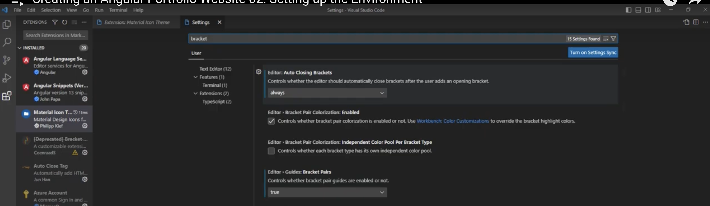

Angular 15 is used for developing the Portfolio Website
https://www.youtube.com/watch?v=HQRIw2kdzOY&list=PLN0Th-4WgKrUVQlqa14mUDeymTW1luznW&index=2

Code Editor- VSCODE

VSCode Extensions
1.Angular Language Service

2. Angular Snippets

Note: This is developed for angular 13. As per author it is good for Angular 15. Check out the latest versions which support Angular
3. Material Ico Theme


VSCode Settings
Go To Settings
Set Brackets - will help the Code Blocks

AutoClosing - Help for auto completion


Node Version 18.x


Install Angular 15

```
Note: Very Important to add 15 at the end as this application is developed in angular 15 
-g stands for global
npm install -g @angular/cli@15
