# Create angular website
@@ Command to install angular cli 15 at system level
```
npm install -g @angular/cli@15
```
Check the angular cli version
```
ng version
```
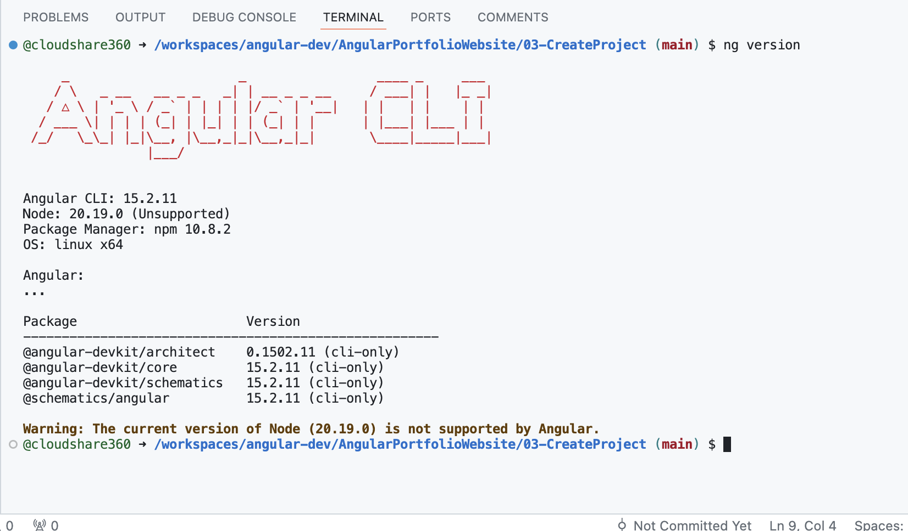
name of the prject would be angular-portfolio-website
to keep simple, I am creating as angular-portfolio-app
```
ng new angular-portfolio-app
```
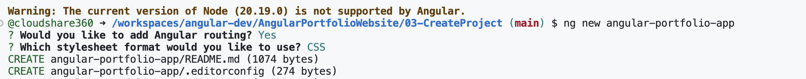

Once you create the app. navigate to the folder, one will find the index.html

angular-portfolop-app
AngularPortfolioWebsite/03-CreateProject/angular-portfolio-app/src/index.html

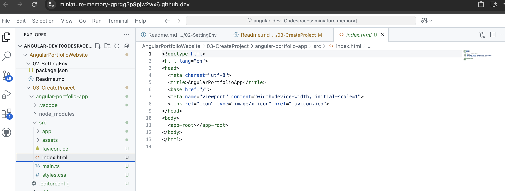


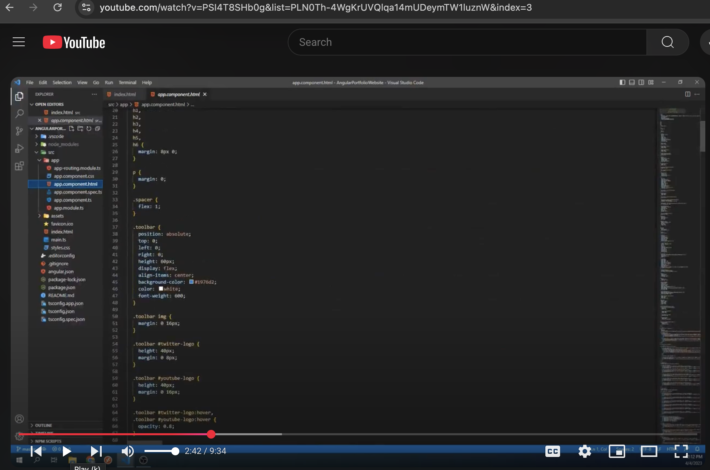

Angular App Component - html - containing , css, html content.
when angular app is opened, this is the content once view on angular app.
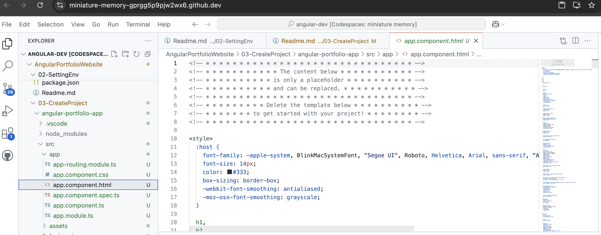

To Start the angular project
```
ng server
```
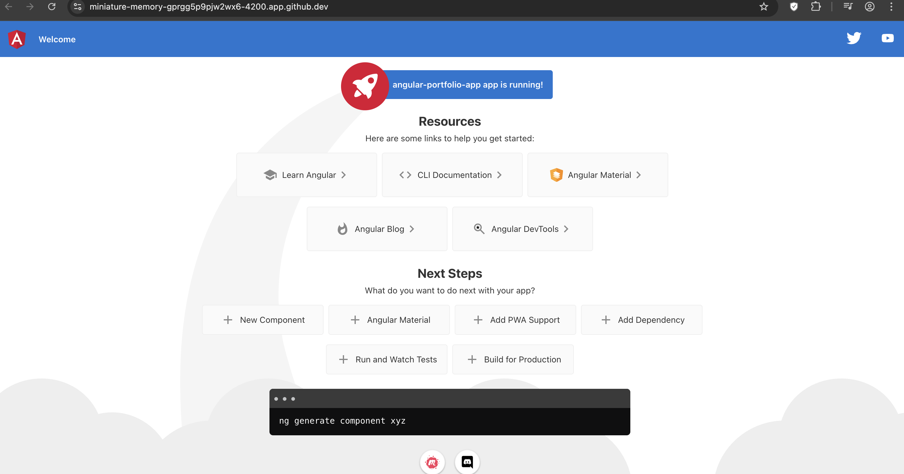
Now delete the content in app.component.html ( AngularPortfolioWebsite/03-CreateProject/angular-portfolio-app/src/app/app.component.html)
Add h1 tag which contains HelloWorld!
Next is the angular components 
![]
](image-6.png)
Angular Portfolio website has multiple components
Header
Nav Bar Component
and When you click on each tab, it is a component.
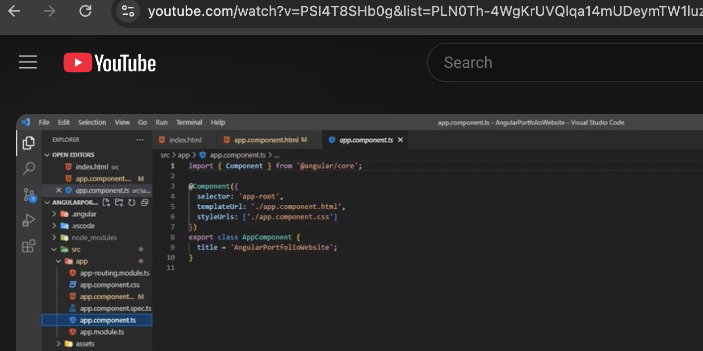
Title Component in TS file
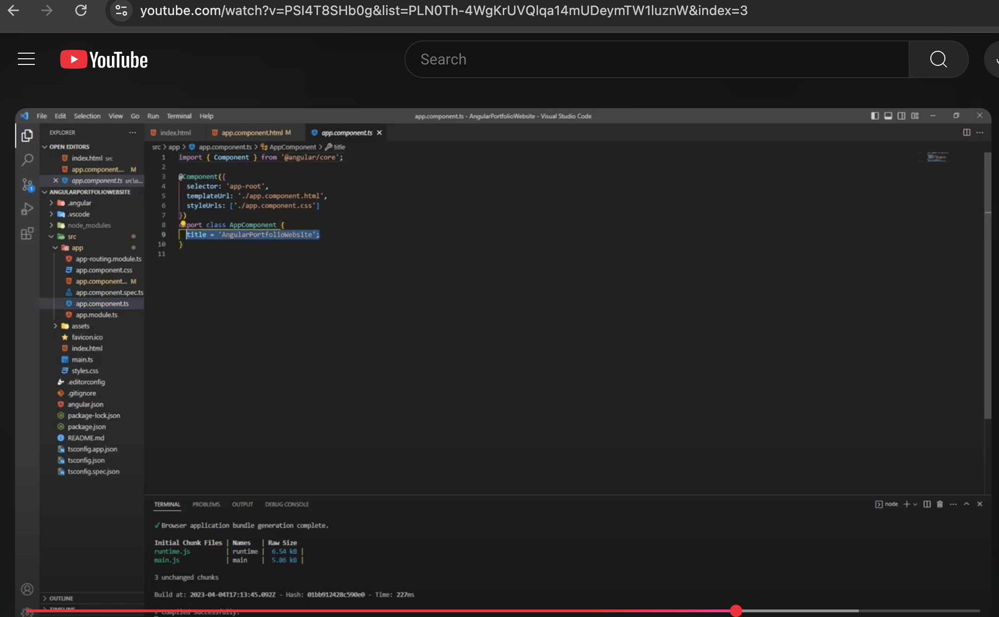
Adding Title Variable from Ts Component to Component's Html using Decorator
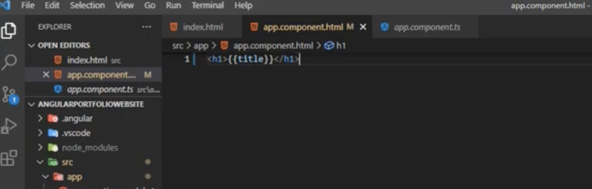
Visiting site Back
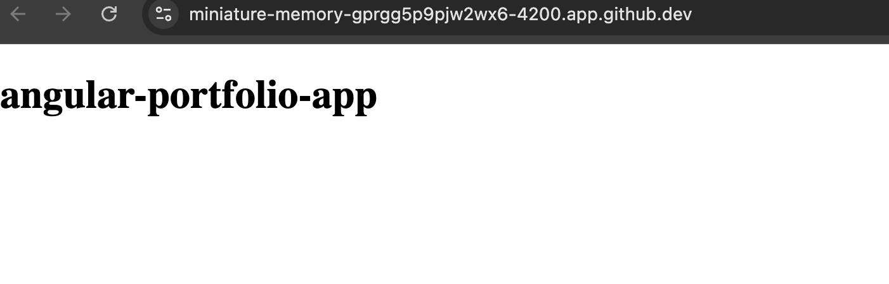
The last part of the component is selector
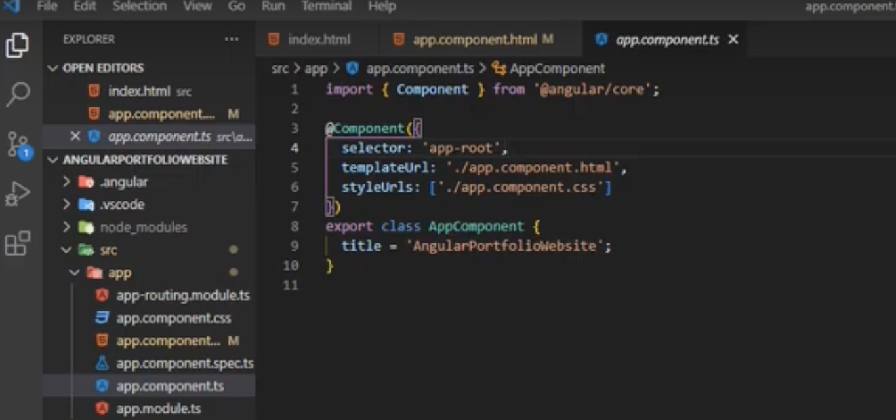
select is app-root which is refered in index.html
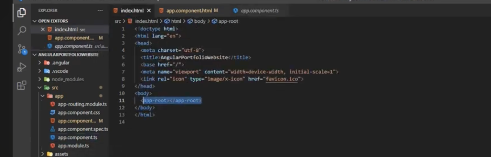
App Module
App Module contains Declarations and Imports
These are the two sections one has to modify when a new components are added.
The last part is the angular.json
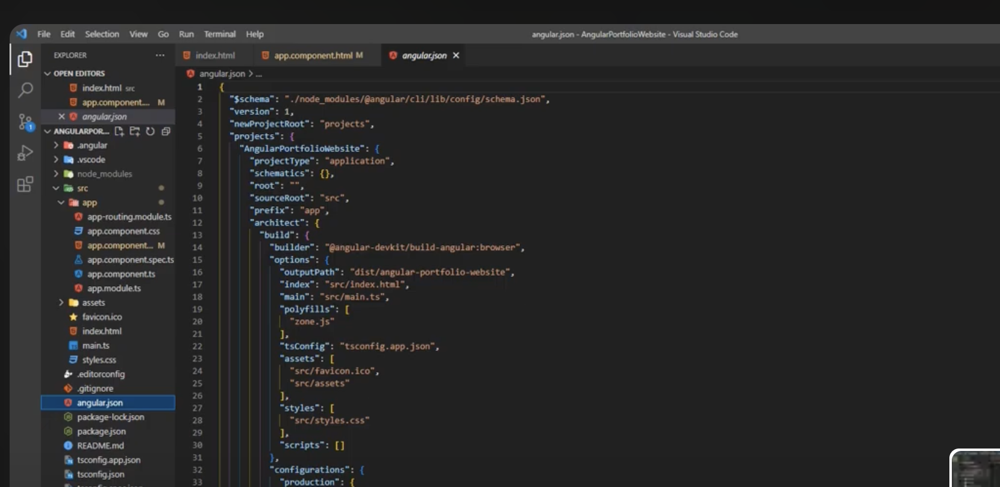