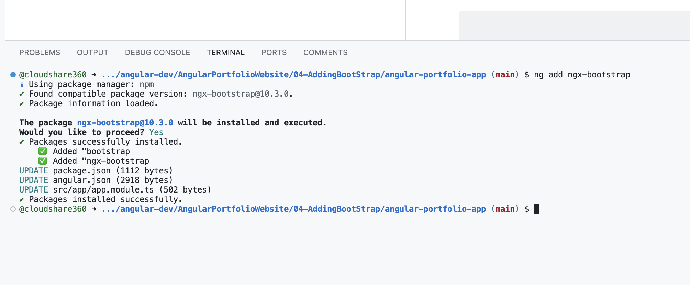
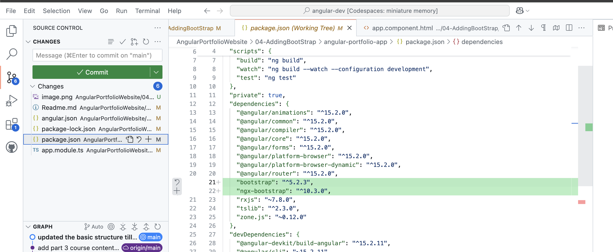
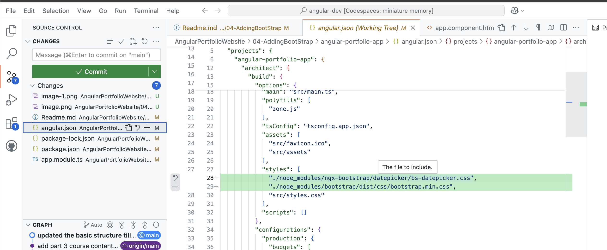
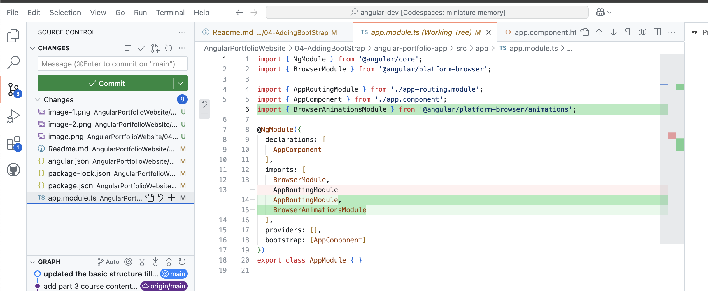

# Adding Boot Strap

## Important Command 
### Intall Angular cli
```
npm install @angular/cli@15
```
### verify the installation
```
ng version
### create angular application
```
ng new angular-portfolio-app
```

I am adding the decorator by modifying angular app component.html 

From here onwards it will be related to adding bootstap
https://valor-software.com/ngx-bootstrap/
Component Library 

```
ng add ngx-bootstrap
```


when you add boot strap to angular it modfied 3 files
UPDATE package.json (1112 bytes)
UPDATE angular.json (2918 bytes)
UPDATE src/app/app.module.ts (502 bytes)
Let us understand the changes

Package.json  changes


Angular.json changes


App Module 

By Default Website font is times new Roman
when you install ng bootstrap, it will update the required dependcies in above 3 mentioned files and update the lastest modren font
