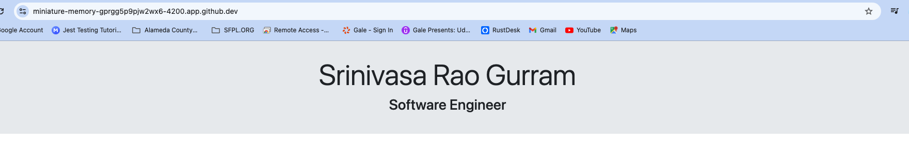

# Creating an Angular Portfolio Website 05: Building the Site Header
## Important Command 

### Intall Angular 

```
npm install -g @angular/cli@15
```

### verify the installation
```
ng version
```

### create angular application
```
ng new angular-portfolio-app
```

### adding bootstrap
```
ng add ngx-bootstrap
```
Now As per current iteration, we need to add Site Header

As per the flow let us add a header component 
``` 
ng g c header
```
or 
``` 
ng g c header --skip-tests // to avoid adding unit testcases
```
After adding the header the site looks like as follows



