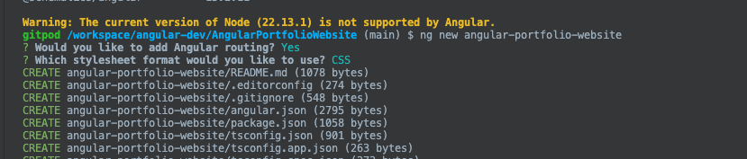

https://www.youtube.com/watch?v=pGZvI6GCr2g&list=PLN0Th-4WgKrUVQlqa14mUDeymTW1luznW


Every 6 months Angular releases new Versions

App is Developed using Angular 15

02 Creating an Angular Portfolio Website 02: Setting up the Environment

VS Code Extension
Angular Language Service
Angular  Snippets
Material Icon


This Series will follow 
Install Angular Cli with 15
```
npm install -g @angular/cli@15
```
Verify the installation
```
ng version
```
03- Creating an Angular Portfolio Website 03: Creating the Project
Create Angular App
Verify the Project File
Angular Version 15.2.11
Create a Angular Portfolio Website
```
ng new angular-portfolio-website
```
Routing is Yes
CSS is Yes
and continue to create angular application


Angular is single page application
index.html  has app-root- is the entry point of angular app

app - app component 
app.component.html

To run the angular application, we use ng serve
```
ng server
```