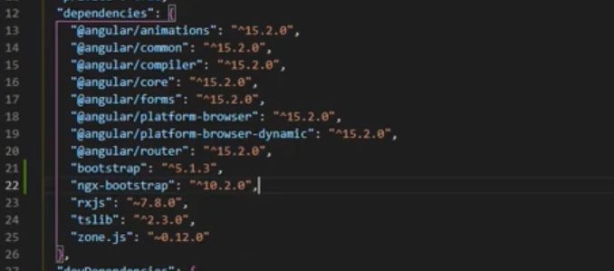
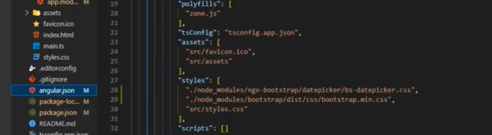
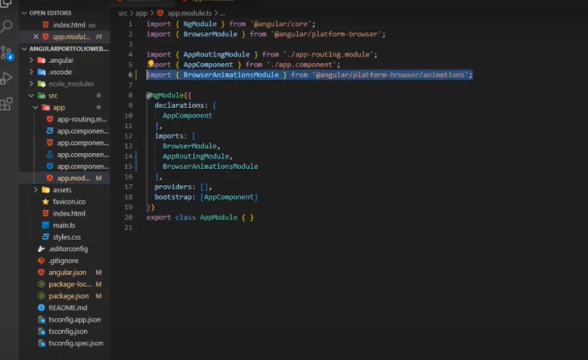
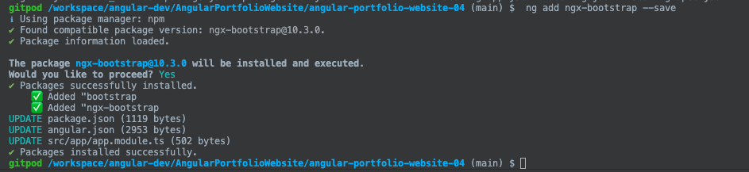

https://www.youtube.com/watch?v=pGZvI6GCr2g&list=PLN0Th-4WgKrUVQlqa14mUDeymTW1luznW

Part 1:


Every 6 months Angular releases new Versions

- Part 2:
  - app is Developed using Angular 15
  - npm install -g @angular/cli@15

- Part3: 
  - Created the Angular Project using 
  - ng new angular-portfolio-app

- Part4: 
  - adding bootstrap to angular
  - Default font is TimeNewRoman
  - BootStrap will simplify the Development
  - Library - ngx bootstrap
  - https://valor-software.com/ngx-bootstrap/
  - How to Install ngx bootstrap
    '''
    ng add ngx-bootstrap
    or
     ng add ngx-bootstrap --save
    ```
    After executing the command , it will modifify following files
    package.json - adding bootstrap, ngx bootstrap to dependencies
    
    angualr.json - boot strap added to styles array
    
    app.module.js - added import statement and added to imports array
    
    


