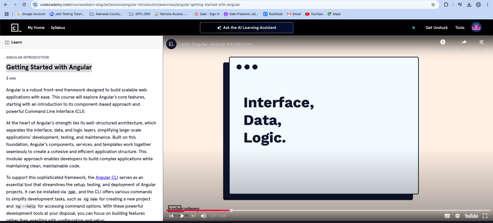
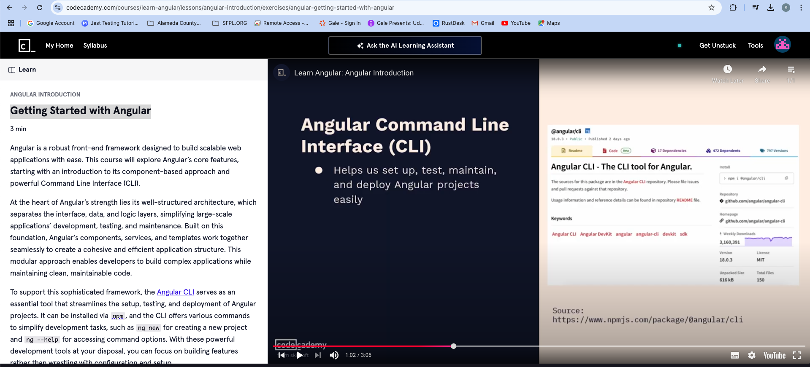

# [Learn Angular](https://www.codecademy.com/courses/learn-angular/)


- Angular Layers
    - Interface
        - User Interactions & Displays data
        
    - Data
        - Application Data & state
            
    - Logic
        - Businesss Logic & application logic
            
- Interafce, Data Logic 
    - By Seperating Layers, It makes it easy to develop large and scalable applications
    - 

Angular has
   - Components
   - Templates
   - Routing
   - Data Binding
   - Component Interactions
   - Signals

Angular Command Line Interface CLI

ng --help


-vsCode

Install the Angular CLI
```
npm install -g @angular/cli
```
To Create New Angular App
```
ng new angular-app
```


Video Transcript

Hi, I'm Imran and today we are going to explore Angular, a powerful and opinionated front-end framework designed for building scalable web applications. Angular uses typescript and follows a component-based approach. This means it separates the interface, data, and logic, making our  code easier to manage and to use. The interface layer handles the user interactions and displays, the data layer manages the application's data and state, and the logic layer processes the business rules and application logic.

By separating these layers Angular makes it easier to develop, test, and maintain large-scale applications. Angular's components, services, and templates collaborate  to compose an Angular application. In this module, we will focus on these basics. Throughout this course, you will learn other aspects that make up an Angular application, such as routing, data binding, component interactions, and signals. Now, let's talk about the Angular CLI. The CLI  or Command Line Interface is a tool that helps us  set up, test, maintain, and deploy Angular projects easily.

To use Angular, users need to install the CLI using npm. The CLI provides different types of commands to streamline  various tasks in Angular development. for example, one of the commands available is ng help, which  provides a list of all available commands and options. This makes it easy to find what we need without leaving the terminal. Now let's move over to Visual Studio Code to see the Angular CLI in action. In the terminal, I am going to write the ng new command followed by the name of the project I want to create.

This command sets up the project structure and  configurations for us so we can start coding right away. As I run the ng new command, it will ask us some questions, such as which style sheet format we prefer and whether we want to enable server side rendering or static side generation. Choosing server side rendering  improves performance by rendering on the server, while static side generation generates  static pages for faster load times and better SEO. Now that the setup is complete,  we will see a well-organized project directory.

This structure follows Angular's best practices, making  development testing and maintaining straightforward. Key parts of our projects include the SRC folder, which contains the apps, components, services, and modules. The Angular dot json file, which holds the project's configuration settings. And the package dot json file, which lists the project dependencies and scripts. We will dive deeper into the file structure in our next exercise. So in this video, we have covered the basics of Angular's core concepts and the Angular CLI.

Let's move on to the next exercise to explore more about  the project setup and file structure. Thank you!

### Summary

In this video, presented by Imran, the focus is on Angular, a prominent front-end framework known for building scalable web applications. The framework employs TypeScript and adheres to a component-based architecture, effectively separating the interface, data, and logic layers. This separation facilitates easier management, testing, and maintenance, particularly crucial for large-scale applications. The video introduces the Angular Command Line Interface (CLI), a vital tool that helps developers set up, test, maintain, and deploy Angular projects. By using npm, users can easily install the CLI, which offers various commands to simplify development tasks. 

Through a live demonstration, Imran shows how to create an Angular project structure using the `ng new` command. This command walks the user through several configuration questions, including the choice of stylesheet format and options for server-side rendering or static site generation, both aimed at optimizing performance and SEO. The video concludes by emphasizing the organized project structure established by Angular best practices, while hinting at deeper exploration into the file structure in subsequent exercises.

### Highlights
- 🎯 Introduction to Angular as a scalable web application framework.
- ⚙️ Emphasis on the component-based architecture that separates interface, data, and logic.
- 📦 Explanation of the Angular CLI's role in project setup and maintenance.
- 💻 Step-by-step demonstration on creating a new Angular project using the CLI.
- 📈 Discussion of performance optimization techniques, including server-side rendering and static site generation.
- 🗂️ Overview of the organized project structure for development ease.
- 🔍 Teaser for upcoming explorations into file structure and more advanced Angular features.

### Key Insights
- 🔑 **Component-Based Architecture Enhances Scalability:** Angular’s architecture separates the application into distinct layers, allowing developers to manage and evolve large codebases more seamlessly. This separation empowers teams to work on different parts of the application without unwanted interference, thereby improving productivity and code quality.
  
- 🔑 **Power of Angular CLI in Development:** The Angular CLI automates many repetitive tasks, enabling developers to focus on writing code rather than managing project configurations manually. The variety of commands available, such as `ng help`, ensures that even beginners can easily navigate and utilize the CLI to its full potential.

- 🔑 **Configuration Flexibility for Performance Optimization:** During the project setup, developers have the opportunity to choose configurations (like stylesheet format and server-side rendering) that directly impact application performance and SEO metrics. Making informed decisions during this stage can lead to significant benefits down the line, especially in product scalability and user experience.

- 🔑 **Structured Project Organization as Best Practice:** The established folder structure aids in maintaining clear separation of concerns among various components, services, and modules. With clear guidelines on where different pieces of the project should reside, developers can maintain clarity and organization, which is crucial during long-term project development.

- 🔑 **Importance of User Interactions and Data Management:** With Angular, user interfaces are built in a way that they interact seamlessly with the underlying data and application logic. Understanding this interaction is critical, as it directly affects how state changes are managed and how users experience the application.

- 🔑 **Future Learning Paths in Angular Development:** The video sets the stage for additional learning about Angular, including advanced concepts like routing and component interactions. This approach not only helps beginners understand the fundamentals but also encourages a deeper dive into the myriad capabilities of Angular.

- 🔑 **Rationale for Using TypeScript in Angular:**  Angular utilizes TypeScript, which adds static typing to JavaScript. This feature can prevent runtime errors and enhance code quality, further underscoring the framework's suitability for large applications where maintaining code integrity is vital.

### Conclusions

This introductory video on Angular by Imran provides a comprehensive look at the framework's structure and tools necessary for developing web applications. It elaborates on the advantages of using Angular, particularly its component-based architecture, which separates interface, data, and logic layers to facilitate scalable development. The Angular CLI's capabilities are highlighted as indispensable for efficient project management, with practical illustrations demonstrating how to set up a new project effectively.

As the tutorial progresses, it becomes apparent that the education provided will not just remain at the surface level, but will delve deeper into Angular's expansive ecosystem, thus equipping viewers with practical skills and theoretical knowledge to build robust web applications. The video serves as a valuable resource for both new and seasoned developers looking to refresh their understanding or explore Angular for the first time. 

Angular's structured approach not only addresses the complexities of web application development but also underlines its commitment to performance and optimization, setting developers on a promising path towards mastering the framework. In upcoming videos, viewers can expect to uncover more intricate aspects of Angular, which will undoubtedly enhance their development proficiency further.