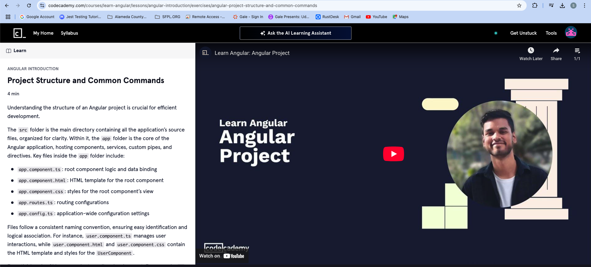
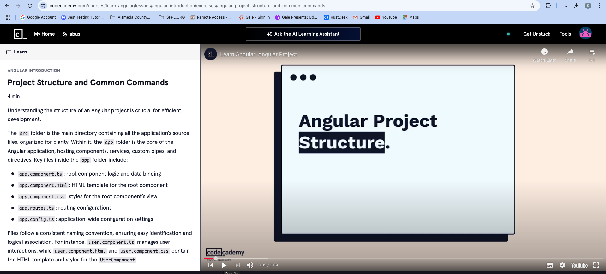
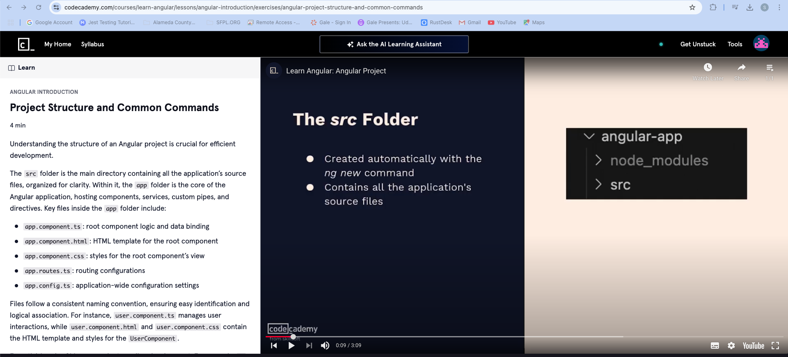
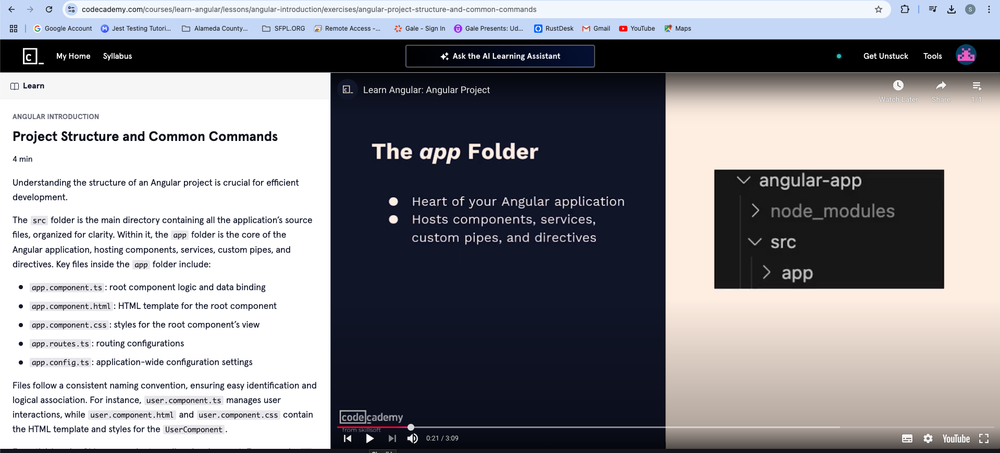
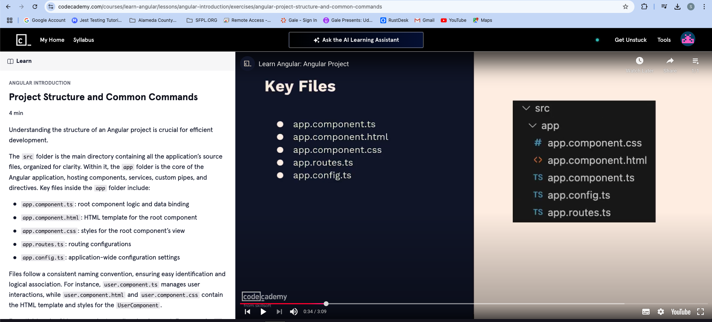
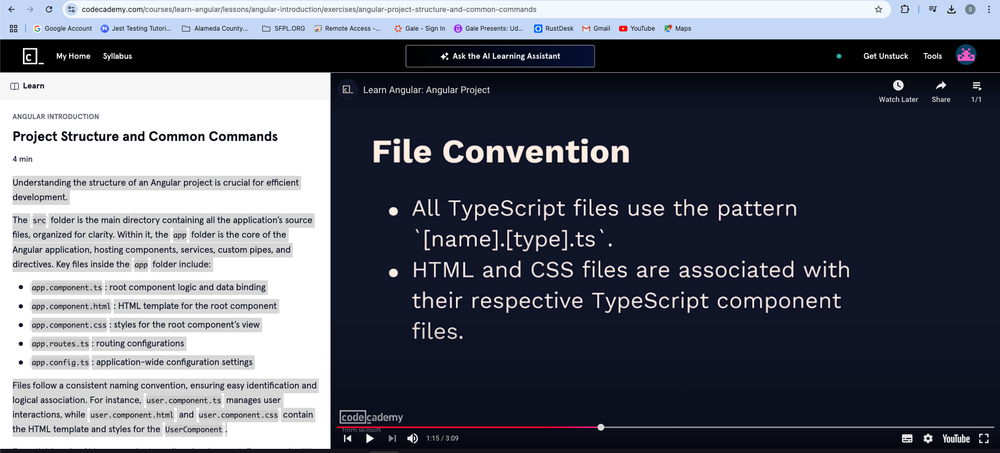
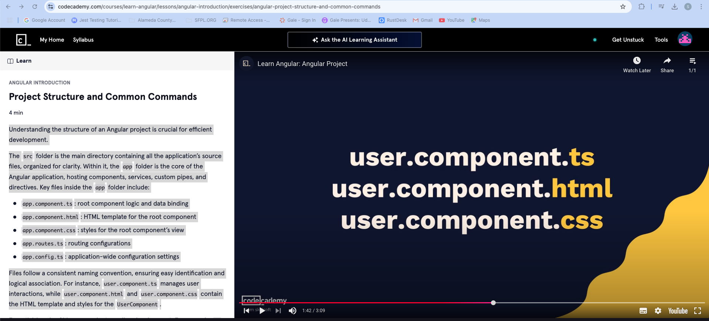
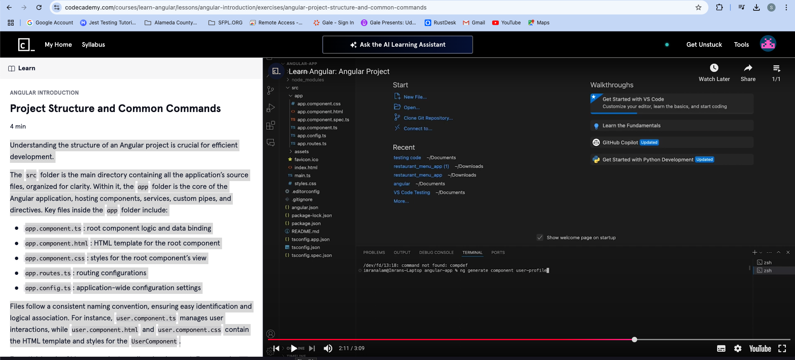
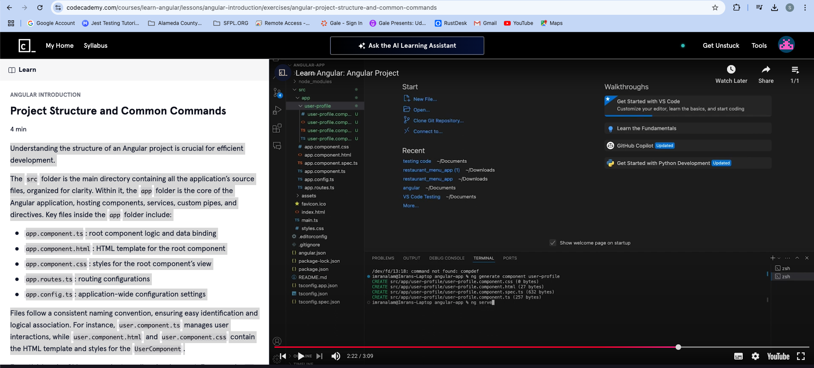
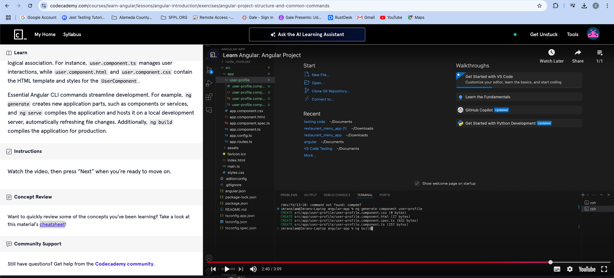

#Angualr Introduction
https://youtu.be/n7LLf73T0tA?list=TLGGDgyQznNM--IyODAzMjAyNQ
##Project Structure and Command Commands

### Angular Project Structure

When you use ng new angular-app command

it creates a directory structure which has src folder

Understanding the structure of an Angular project is crucial for efficient development.

The src folder is the main directory containing all the application’s source files, organized for clarity. Within it, the app folder is the core of the Angular application, hosting components, services, custom pipes, and directives. Key files inside the app folder include:

app.component.ts: root component logic and data binding
app.component.html: HTML template for the root component
app.component.css: styles for the root component’s view
app.routes.ts: routing configurations
app.config.ts: application-wide configuration settings
Files follow a consistent naming convention, ensuring easy identification and logical association. For instance, user.component.ts manages user interactions, while user.component.html and user.component.css contain the HTML template and styles for the UserComponent.

Essential Angular CLI Commands

ng generate component user-profile

ng serve - compiles and host the application
ng build - compiles and create dist folder

https://www.codecademy.com/learn/learn-angular/modules/introduction-to-angular/cheatsheet

Essential Angular CLI commands streamline development. For example, ng generate creates new application parts, such as components or services, and ng serve compiles the application and hosts it on a local development server, automatically refreshing file changes. Additionally, ng build compiles the application for production.

Transcript
Hi, I'm Imran. In this video, we will dive deeper into the Angular project structure generated by the ng command. When you create a new Angular project, the SRC folder is created. It contains all the application source files organized for clarity and logical structure. Within the SRC folder lies the app folder, which is the heart of your Angular application. This folder hosts components, services, custom pipes, and directives. We will learn more about these in future exercises. For now, let's look at some key files inside the app folder.

The app dot component dot ts file defines the root component, handling core logic and data binding. Its HTML template is defined in the app dot component dot html file, which determines what users see. To style this view, we use the app dot component dot CSS file,  which applies specific styles. For navigation, the app dot routes dot ts file manages route configurations, enabling seamless navigation between different views without reloading the page. Lastly, the app dot config dot ts file stores configuration settings  that are accessible throughout the application.

Now, let's discuss file naming conventions in an Angular project. Files in an Angular project are named according to their type and function. All typescript files use the pattern name dot type dot ts. For example, a file named user dot component dot ts manages user interactions where user is the name of the component and component is the type. HTML and CSS files are associated with their respective typescript component files. For instance, user dot component dot html contains the HTML  template for the user component

and user dot component dot CSS file defines the styles specific to the user component. This naming convention ensures that each component's template and styles are easily identifiable and directly linked to their logical definition. Next, let's talk about some essential Angular CLI commands that streamline development. The ng generate command is used to create new parts of an angular application. For example, running ng generate component user profile generates a new component with related files, like

user profile dot component dot ts, user profile dot component dot html, and user profile dot component dot css. The ng serve command compiles the application and hosts it on a local development server, making it accessible via web browser. This command is particularly useful during development, as it watches for file changes and automatically refreshes the browser. Simply run ng serve to start the server. When it's  time to move the application from development to production, the ng build command compiles the application, optimizing files for performance.

The output is placed in the dist directory by default. You can also use options, like watch, to automatically rebuild the application when files change. So in this video, we have explored the Angular project structure and discussed key CLI commands that help in efficient development. From the next exercises, we'll start looking  at the core concepts of Angular. Thank you!

### Summary
In this video, Imran provides a comprehensive overview of the Angular project structure generated by the Angular CLI (Command Line Interface). He explains the significance of different folders and files in an Angular application, particularly focusing on the `SRC` and `app` directories. The `SRC` folder contains all the source files necessary for the application, while the `app` folder is described as the core of the application where components, services, custom pipes, and directives reside. Key files like `app.component.ts`, `app.component.html`, and `app.routes.ts` are explained, showcasing their functionalities—ranging from defining the root component to managing routing for smooth user navigation. The video also touches on file naming conventions, confirming that they follow a clear pattern to facilitate organization and identification of roles. Furthermore, the tutorial introduces essential Angular CLI commands such as `ng generate`, `ng serve`, and `ng build`, which play a critical role in streamlining development processes. With this foundational knowledge of Angular's structure and commands, viewers are primed to further explore core Angular concepts in subsequent exercises.

### Highlights
- 🚀 Introduction to the Angular project structure, focusing on the significance of the `SRC` folder.
- 🏗️ The `app` folder as the heart of an Angular application housing critical components and services.
- 🔑 Key files explained: `app.component.ts`, `app.component.html`, and routing with `app.routes.ts`.
- 📂 Importance of naming conventions in Angular files which enhance clarity and organization.
- ⚙️ Essential Angular CLI commands introduced to facilitate development, including `ng generate`, `ng serve`, and `ng build`.
- 🌍 The audience is invited to anticipate upcoming exercises that will delve deeper into core Angular concepts.
- 🎓 Impartation of knowledge aimed at empowering developers to efficiently navigate the Angular framework.

### Key Insights
- 📁 **Angular Project Structure: Understanding the `SRC` folder**  
  The `SRC` folder is crucial in Angular, housing all the source files needed for the application. Its structure aids developers in maintaining clarity, ensuring that source code is organized and easily navigable. This organization helps in rapid development and easier debugging, reinforcing best practices in software development.

- 🌟 **Core `app` Directory: The Central Application Hub**  
  The `app` folder is described as the heart of the application. Hosting components, services, and directives, it plays a pivotal role in defining the application's behaviors. Understanding this central hub ensures a better grasp of how Angular applications are architected, allowing developers to implement design patterns effectively.

- 📝 **Importance of File Naming Conventions**  
  Adhering to naming conventions such as `name.type.ts` for TypeScript files significantly enhances code readability and maintainability. It allows developers to quickly identify the purpose of each file, which is particularly valuable in larger projects where multiple developers may be contributing code.

- ⚙️ **Mastering Angular CLI Commands**  
  Familiarity with Angular CLI commands like `ng generate`, `ng serve`, and `ng build` is vital for efficient development. These commands enable developers to create new components swiftly, serve applications locally, and build production-ready applications with optimizations, streamlining workflow and reducing repetitive tasks.

- 🔄 **`ng serve` for Live Development**  
  The `ng serve` command compiles and serves the application, refreshing automatically as file changes are made. This feature is priceless during development, allowing for rapid iterations and immediate visibility of changes, which greatly enhances productivity.

- 🚀 **Scaling with `ng build`**  
  Moving from development to production is simplified with the `ng build` command, which compiles the application into an optimized state for public deployment. Understanding when and how to use this command is essential for ensuring performance and lower loading times in production environments.

- 🔼 **Anticipation of Core Angular Concepts**  
  The video sets the stage for upcoming lessons on core Angular concepts, preparing viewers to deepen their understanding of the framework. This foundational knowledge equips developers with the tools needed to build robust Angular applications, encouraging continued learning and exploration of advanced topics.

With this in-depth analysis of the Angular project structure, file management, and command-line interfaces, developers are poised to embark on their journey with Angular, armed with essential insights that will facilitate their learning and project execution. The clarity provided in the video enhances their ability to effectively utilize Angular for building dynamic web applications that meet modern user demands.